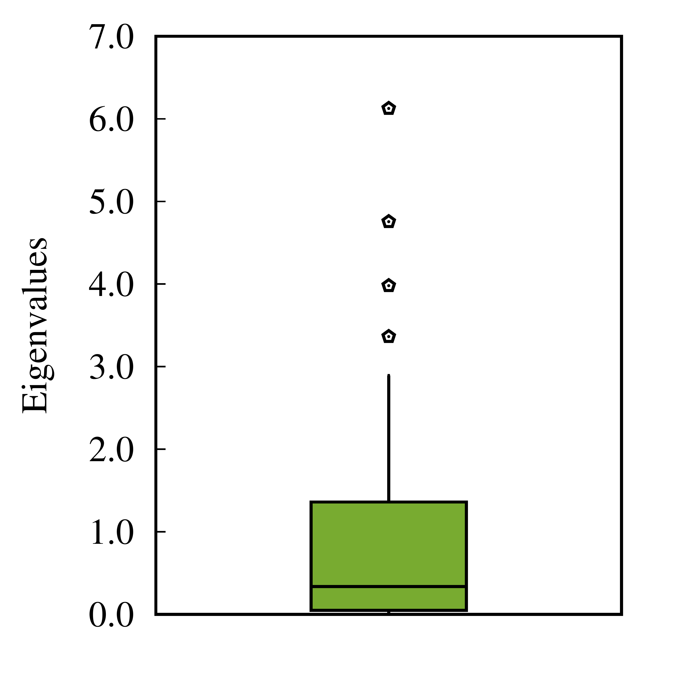

# Effective Dimension and Fisher Spectrum calculation 

This repository produce an example application to calculate the effective dimension and Fisher spectrum of a statistical Torch module.
It shows how to use the  [Fisher Matrix library](https://github.com/EddyTheCo/Fisher_Matrix) for this purposes. 
It uses [yaml](https://github.com/jbeder/yaml-cpp) [input files](INPUT) for the configuration of the application. 

## Dependencies 

* libtorch from [Pytorch](https://pytorch.org/)


## CMake variables for configuration

|name|values|description|
|----|------|-----------|
|MODEL|DNN_abbas,EQM_abbas,QNN_abbas ..|The torch module to use as a statistical model and calculate the Fisher Information Matrix. One can create custom modules and add it to the namespace custom_models.|

## Install and Execute

### Build and install
```
git clone git@github.com:EddyTheCo/Fisher_app.git Fisher_app 
cd Fisher_app 
mkdir build
cd build 
cmake -DCMAKE_INSTALL_PREFIX=install -DMODEL=DNN_abbas -DCUSTOM_MODULES="DNN_abbas" ../
cmake --build . --target install -- -j4
```

### Execute

```
cd  install
./bin/fisher_app INPUT/dnn_abbas_config.yaml
```

### Results

The normalized spectrum of the calculated Fisher matrices is written in the file Spectrum.txt. 
The Effective dimension results are written to the file Effect_dime.txt.
To reproduce the results from the paper one could use the gnuplot scripts like:
```
gnuplot gnuplot/effectiveD.gnu
gnuplot gnuplot/eig_distr.gnu
```  
When trying to reproduce the results of the paper the obtained results were

**Quantum neural network**


 
**Easy quantum model**





 
**Classical neural network** 


